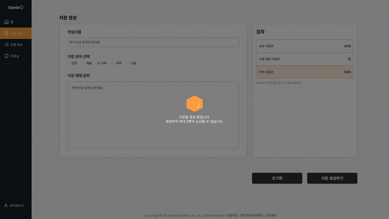
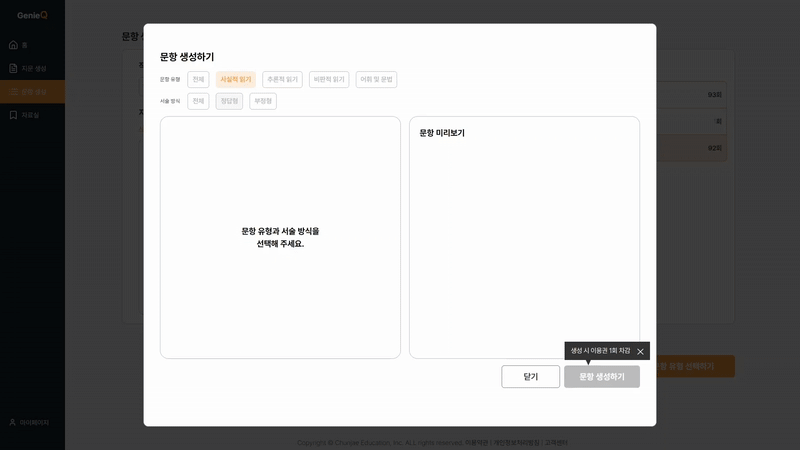
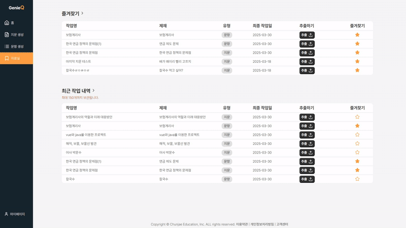
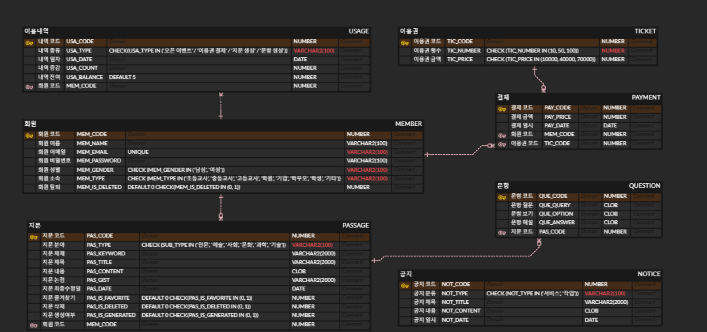

# GenieQ - AI 기반 지문 및 문항 생성 서비스

  
  GenieQ는 교육자를 위한 생성형 AI 기반 국어 비문학 지문 및 문항 생성 서비스입니다.

  👉 <a href="http://43.202.6.90/team/genius/kwanghoon">소개 페이지 바로가기</a>

## 👥 팀 구성원

<table>
  <tr>
    <td align="center">
      <a href="https://github.com/hoonee-math">
        
         
        <b>최광훈</b>
      </a>
    </td>
    <td align="center">
      <a href="https://github.com/daineee424">
        
         
        <b>정다인</b>
      </a>
    </td>
    <td align="center">
      <a href="https://github.com/blue032">
        
         
        <b>이예진</b>
      </a>
    </td>
    <td align="center">
      <a href="https://github.com/woogamjaa">
        
         
        <b>우민혁</b>
      </a>
    </td>
    <td align="center">
      <a href="https://github.com/my2min0">
        
         
        <b>이민영</b>
      </a>
    </td>
    <td align="center">
      <a href="https://github.com/minho0802">
        
         
        <b>김민호</b>
      </a>
    </td>
  </tr>
</table>

## 🛠 기술 스택

### 🎨 Frontend

  
  
  
  

### 🧩 Backend

  
  
  
  
  

### 🗄️ Database / DevOps

  
  
  
  

### 🧑‍💻 개발 환경

  
  
  

## 📂 레포지토리

| 구분 | 링크 |
|------|------|
| 🖥️ Frontend | [2nd_GenieQ_FrontEnd](https://github.com/ChunJae-Full-Stack-FinalProject/2nd_GenieQ_FrontEnd) |
| 🛠️ Backend  | [2nd_GenieQ_BackEnd](https://github.com/ChunJae-Full-Stack-FinalProject/2nd_GenieQ_BackEnd) |

## ✨ 주요 기능

### 📝 지문 생성

사용자는 다양한 분야(인문, 예술, 사회, 과학, 기술)와 제재를 선택해 AI가 생성한 맞춤형 지문을 받아볼 수 있습니다. 핵심 논점이 자동 추출되며, 편집 및 PDF·Word·TXT 포맷으로의 출력이 가능합니다.

### ❓ 문항 생성

AI는 생성된 지문 또는 직접 입력한 텍스트를 바탕으로 객관식 문항을 자동 생성하며, 정답과 해설도 함께 제공합니다. 문항은 수정·추가가 가능하여 학습 목적에 맞게 조정할 수 있습니다.

### 📂 자료실

생성한 지문과 문항을 체계적으로 저장·관리할 수 있으며, 최근 작업과 즐겨찾기를 통해 빠르게 접근할 수 있습니다. 최대 150개 자료까지 보관 가능하며, 다양한 포맷으로 추출해 수업에 활용할 수 있습니다.

## 🧭 화면 플로우 차트

서비스의 전체 사용자 흐름을 보여주는 플로우 차트입니다.

## 🗂 ERD 설계도

GenieQ 서비스의 데이터베이스 구조를 시각적으로 표현한 ERD입니다.

